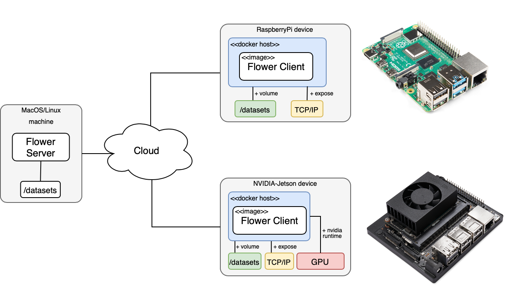

# Federated Learning on Embedded Devices with Flower


## Getting things ready

This is a list of components that you'll need: 

* For server: A machine running Linux/macOS.
* For clients: either a Rapsberry Pi 3 B+ (RPi 4 would work too) or a Jetson Xavier-NX (or any other recent NVIDIA-Jetson device).
* A 32GB uSD card and ideally UHS-1 or better. (not needed if you plan to use a Jetson TX2 instead)
* Software to flash the images to a uSD card (e.g. [Etcher](https://www.balena.io/etcher/))

What follows is a step-by-step guide on how to setup your client/s and the server. In order to minimize the amount of setup and potential issues that might arise due to the hardware/software heterogenity between clients we'll be running the clients inside a Docker. We provide two docker images: one built for Jetson devices and make use of their GPU; and the other for CPU-only training suitable for Raspberry Pi (but would also work on Jetson devices). The following diagram illustrates the setup for this demo:

<!-- jetson xavier-nx image borrowed from: https://developer.nvidia.com/embedded/jetson-xavier-nx-devkit -->


## Setting up a Raspberry Pi (3B+ or 4B)

1. Install Ubuntu server 20.04 LTS 64-bit for Rapsberry Pi. You can do this by using one of the images provided [by Ubuntu](https://ubuntu.com/download/raspberry-pi) and then use Etcher. Alternativelly, astep-by-step installation guide, showing how to download and flash the image onto a uSD card and, go throught the first boot process, can be found [here](https://ubuntu.com/tutorials/how-to-install-ubuntu-on-your-raspberry-pi#1-overview). Please note that the first time you boot your RPi it will automatically update the system (which will lock `sudo` and prevent running the commands below for a few minutes)

2. Install docker (+ post-installation steps as in [Docker Docs](https://docs.docker.com/engine/install/linux-postinstall/)):

    ```bash
    # make sure your OS is up-to-date
    $ sudo apt-get update

    # get the installation script
    $ curl -fsSL https://get.docker.com -o get-docker.sh

    # install docker
    $ sudo sh get-docker.sh

    # add your user to the docker group
    $ sudo usermod -aG docker $USER

    # apply changes to current shell (or logout/reboot)
    $ newgrp docker
    ```

3. (optional) additional packages: you could install `TMUX` (see point `6` above) and `htop` as a replacement for `jtop` (which is only available for Jetson devices). Htop can be installed via: `sudo apt-get install htop -y`.

# Running FL training with Flower

>If you'd like to make use of your own dataset you could [mount it](https://docs.docker.com/storage/volumes/) to the client docker container when calling `docker run`. We leave this an other more advanced topics for a future example.

## Server

Launch the server and define the model you'd like to train. The current code (see `utils.py`) provides two models for CIFAR-10: a small CNN (more suitable for Raspberry Pi) and, a ResNet18, which will run well on the gpu. Each model can be specified using the `--model` flag with options `Net` or `ResNet18`. Launch a FL training setup with one client and doing three rounds as:

```bash
# launch your server. It will be waiting until one client connects
$ python server.py --server_address <YOUR_SERVER_IP:PORT> --rounds 3 --min_num_clients 1 --min_sample_size 1 --model Net
```

## Clients

Asuming you have cloned this repo onto the device/s, then execute the appropiate script to run the docker image, connect with the server and proceed with the training. Note that you can use both a Jetson and a RPi simultaneously, just make sure you modify the script above when launching the server so it waits until 2 clients are online. 


### For Raspberry Pi

```bash
# note that pulling the base image, extracting the content might take a while (specially on a RPi 3) the first time you run this.
$ ./run_pi.sh --server_address=<SERVER_ADDRESS> --cid=0 --model=Net
```
